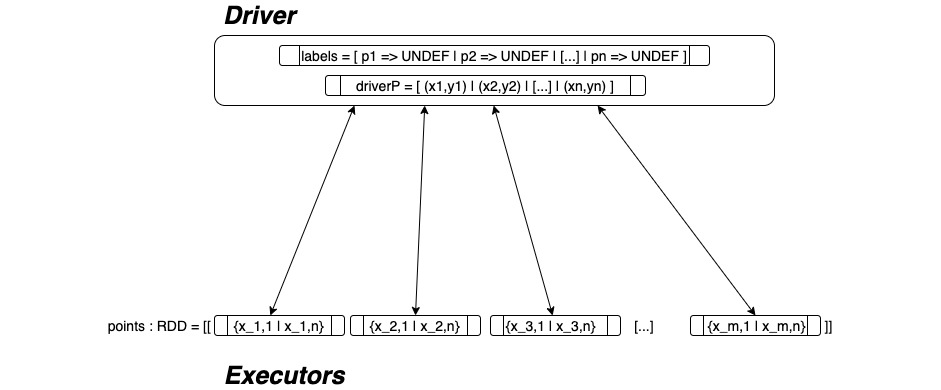

# DBSCAN-distributed
Implementazione Scala + Spark dell'Algoritmo di clustering DBSCAN

## Algoritmo  DBSCAN 

L'algoritmo DBSCAN e' un algoritmo di clustering, che divide un dataset in un numero di gruppi non fissato a priori.

Questo algoritmo itera il punti del dataset (**foreach** *p* **in** *DS*) per ogni *p* determina tutti i punti nella sua neighborhood calcolando la funzione  
*distance(p1:(**Double,Double**),p2:(**Double,Double**)):Boolean*. 

Una volta calcolati tutti i punti li conta, se questo conteggio *c* risulta essere minore di un certo valore prestabilito *minCount* allora *p* e' etichettato con label *NOISE*, altrimenti diventa il primo punto di un nuovo cluster. 
    
A questo punto ogni punto nella neighborhood di *p* entra a far parte del cluster se a sua volta nella sua neighborhood ci sono almeno *minCount* punti. 

Ricorsivamente ogni punto avvia la stessa computazione su ogni punto a lui vicino.  
    
L'algoritmo termina nel momento un cui tutti i punti in *DS* sono stati etichettati. 
    

 
<a href="https://towardsdatascience.com/the-5-clustering-algorithms-data-scientists-need-to-know-a36d136ef68"> Image From Here </a>

## Implementazione

### Introduzione
Per prima cosa importiamo il dataset, che supponiamo essere nel file **clusterin**, in un RDD Spark 

~~~scala
val linesList = sc.textFile("clusterin")
~~~
La funzione **SparkContext.textFile** restituisce una struttura dati dove gli elemento e' una riga del file in input  Convertiamo questa struttura in una struttura contenente delle coppie di *Double* che rappresentano le coordinate di punti nel piano cartesiano 

~~~scala
val regex = "\\s+"
def toFloat(s: String): Float = {
  try {
    s.toFloat
  } catch {
    case e: Exception => 0
  }
}
def toCouple(a : Array[Float]) : Array[(Float,Float)]= {
val c =(a(0),a(1))
Array(c)
}
val points=linesList.flatMap(x=>toCouple(x.split(regex).map(x=>toFloat(x))))
~~~

### Architettura

<kbd>
  
</kbd>

Sappiamo come un cluster Spark sia composto da un nodo detto *Driver* che ha il compito di fare da facciata tra l'applicazione ed i nodi *Executor*. In questo scenario e' importante capire quali sono le strutture dati in gioco ed in quali nodi queste si trovino.

Importando il dataset tramite la chiamata alla funzione Spark, abbiamo creato uno struttura dati contenente una rappresentazione dei punti nel dataset. Questi punti vengono partizionati e memorizzati sui nodi *Executor* e la struttura e' associata alla variabile **points**.

Creiamo poi una copia **non** distribuita della struttura points, da mantenere sul nodo *Driver*, chiamiamo questa struttura **driverP**

~~~scala
val driverP = points.collect()
~~~

In seguito creiamo una mappa per etichettare ogni punto nel dataset. Inizializziamo tutte le etichetta al valore **UNDEF**. Chiamiamo questa struttura **labels** e questa sara' anch'essa memorizzata nel nodo *Driver*

~~~scala
//https://stackoverflow.com/questions/7938585/what-does-param-mean-in-scala
// : _* PASS EACH ELEMENT IN SEQ AS SINGLE ARGUMENT TO MAP CONSTRUCTOR
val labels = collection.mutable.Map(   points.collect().map( (_,UNDEF) )   toSeq : _*)
~~~

### Main Loop 

Prima di avviare la computazione, dobbiamo definire due valori costanti a priori, che sono **Epsilon** e **MinCount**. Questi parametri definiscono il comportamento dell'algoritmo e vengono passati da linea di comando tramite le opzioni `--eps` e `--minc` rispettivamente.

Inoltre dobbiamo definire la funzione di distanza tra due punti dello spazio. Nel caso particolare, la nostra libreria prevede di lavorare su punti nello spazio bidimensionale. Tuttavia e' possibile ovviare a questa limitazione, sia applicanto ai vettori in input degli algoritmi di riduzione della dimensionalita' come ad esempio l'algoritmo **PCA**, sia definendo una specifica funzione *distance* che di fianco al dataset definisca la distanza tra due punti nello spazio individuato. Essendo infatti il linguaggio `Scala` funzionale, non e' difficile pensare ad una versione *higher-order* della nostra funzione contenente il main-loop, che riceva in input la funzione *distance* definita dall'utente utilizzatore.

Nel nostro caso comunque la libreria prevede di ricevere punti bidimensionali e per tanto la funzione *distance* sara' semplicemente la distanza euclidea tra due punti 

~~~scala

def distance(p1:(Double,Double),p2:(Double,Double))= 
    math.sqrt(math.pow(p1._1-p2._1,2)+math.pow(p1._2-p2._2,2))
~~~

Con queste premesse possiamo analizzare il cuore dell'algoritmo implementato.

Per etichettare ogni punto **p** come appartenente ad un determinato cluster dobbiamo per prima cosa calcolare l'insieme dei punti che si trovano all'interno del **Neighborhood** di **p**. Questo insieme e' definito come l'insieme dei punti che hanno distanza **d** da **p** minore del parametro **Epsilon**.

~~~scala
val dim = points.count()
var clusterNum = 0

for(it <- 0 until dim.toInt){outbreak.breakable{
    //[...]
    val p = sc.broadcast(driverP(it))

~~~

Iteriamo quindi sui punti, preso il primo non ancora etichettato, lo rendiamo visibile a tutti i nodi executor tramite il metodo 
**SparkContext.broadcast**

~~~scala
    //IN EXECUTOR
    val neighs = points.filter(x => distance(p.value,x)<=epsilon)
~~~

Dato il punto **p**, ogni **Executor** calcola la distanza rispetto a **p** di ognuno dei punti contenuti nel suo nodo. Dopodiche' filtra tutti quei punti la cui distanza e' minore di *Epsilon*.

~~~scala

    //IN DRIVER
    var queue = neighs.collect().toSet
    val c = queue.size
    if(c<minCount){
        labels(driverP(it))=NOISE
    }
    else{//CREATE NEW CLUSTER
~~~

Dopo che ogni *Executor* ha calcolato quali tra i suoi punti appartengono al vicinato di **p**, li comunica tutti al nodo *Driver*. Questo colleziona gli insiemi ricevuti da tutti gli *Executor*, li unisce e ne calcola la dimensione, che chiamiamo **c**.

È importante sottolineare il motivo per cui il calcolo di **c** non viene effettuato tramite la funzione **RDD.count()** che effettuerebbe un conteggio parziale nei nodi per poi sommare questi valori nel *Driver* richiedendo cosi' minore *Shuffling*. Il motivo e' legato all'utilizzo della struttura dati **queue**. 

Infatti, poiche' vogliamo iterare su tutti i vicini di **p**, per poi potenzialmente aggiungerli al cluster in cui quest'ultimo e' contenuto, abbiamo bisogno di fare una **RDD.collect()** su questi dati per portarli nel *Driver*. Per cui nel momento in cui abbiamo gia' collezionato la struttura **queue**, un calcolo di **c** tramite chiamata a **RDD.count()** porterebbe soltanto ad ulteriore *Shuffling* non necessario. 

~~~scala
        //CLUSTER LABEL 
        clusterNum = clusterNum + 1
        labels(driverP(it))=clusterNum
        //[...]
        while(queue.size>0){inbreak.breakable{
            val h =queue.head
            //[...]
            labels(h) = clusterNum
            val q = sc.broadcast(h)
            //[... SAME AS OUTER FOR LOOP]
    }
}}
~~~

Sulla struttura **queue**, il *Driver* esegue un ulteriore iterazione, uguale a quella precedentemente vista, per andare a calcolare iterativamente l'insieme **Neighborhood** di tutti i punti in **queue** per poi potenzialmente aggiungere questi ultimi al cluster di **p**.

### Criticita' e soluzioni alternative

La fase dell'algoritmo che computazionalmente e' piu' costosa, e' sicuramente la ricerca dei vicini per un determinato punto **p**. Per fare questa ricerca infatti, la modalita' piu' ovvia e' quella di confrontare **p** con ogni altro punto nel *Dataset*. Questa operazione ovviamente non e' molto efficiente, considerando il fatto che per un applicazione distribuita ci si aspetta di lavorare con *Dataset* di grandi dimensioni. La complessita' di questo approccio e' infatti nell'ordine di *O(n)* dove *n* e' la dimensione del *Dataset* in input.

Abbiamo preso in considerazione alcune alternative, per cercare di ottimizzare la complessita' dell'operazione di ricerca dei vicini. Le alternative che vagliate sono state : 

- **Pre-calcolare una matrice delle distanze**    Durante la fase di progettazione dell'algoritmo, abbiamo analizzato l'implementazione di *DBSCAN* nella libreria **Scikit-learn**. Nonostante tale implementazione sia una versione sequenziale, ci e' sembrato interessante l'utilizzo di una matrice, dove vengono pre-calcolate le distanze tra i punti.   Tuttavia, anche se questo espediente potrebbe apportare dei miglioramenti in termini di complessita' temporale, e' noto agli utilizzatori della libreria che questa implementazione e' considerevolmente inefficiente in termini di complessita' spaziale. Questo rende tale approccio inutile ai nostri fini, che sono quelli di lavorare con grandi *Dataset*. 

- **K-D search tree**    La seconda alternativa presa in considerazione, e' stata quella di utilizzare un albero di ricerca. Il problema che e' subito apparso evidente, e' che la progettazione di un albero di ricerca per ordinare vettori *K*-dimensionali non e' un problema di facile risoluzione.  
In letteratura tuttavia e' presente una struttura dati simile a quella necessaria al nostro algoritmo. Questa e' nota come *Albero di ricerca K-d*, dove *K* rappresenta la dimensione dei vettori che la struttura puo' contenere e *d* e' la profondita' pre-fissata dell'albero. La ricerca del **Nearest vector** su un *K-d Tree* ha complessita' spaziale nell'ordine di *O(log n)*, con *n* dimensione del *Dataset*.  
Nonostante questa sia un ottima soluzione al problema nell'ambito della progettazione di un algoritmo sequenziale, non e' scontato che lo sia anche per un algoritmo distribuito come quello che stiamo progettando. Bisogna infatti individuare su quali nodi e' utile memorizzare tale struttura dati. Le possibilita' nel nostro caso sono due. Potremmo memorizzare l'albero di ricerca nel nodo *Driver*. Questa soluzione pero' non sarebbe per niente *Scalabile*, in quanto se l'albero si trovasse su questo nodo, tutto il carico computazionale, che e' rappresentato appunto dalla ricerca dei punti **Neighbor**, sarebbe a suo carico, mentre i nodi *Executor*, nonostante quanti ve ne siano a disposizione nel *Cluster*, non avrebbero nessun operazione da svolgere. In alternativa si potrebbe memorizzare una copia dell'albero su ogni nodo *Executor*. Questo pero' sarebbe molto costoso in termini di complessita' spaziale.
In conclusione si e' deciso di scartare anche questa ipotesi.  

## Test

### Dataset 

Il dataset utilizzato per i test di performance e' disponibile  
sul repository  dell'<a href="https://archive.ics.uci.edu/ml/machine-learning-databases/00550/"> Universita' della California</a>.  
Scaricato il file zip ed estratto, siamo interessati al file 
**urbanGB.txt**. Per rendere questo file utilizzabile dalla nostra applicazione
viene riformattato attraverso il comando 

~~~sh
cat "urbanGB.txt" | sed -Ee 's/([+-]?[0-9]+\.?[0-9]*e?[+-]?[0-9]*)\s*,\s*([+-]?[0-9]+\.?[0-9]*e?[+-]?[0-9]*)/\1 \2/g' 1>"clusterin"
~~~

Nel dataset sono contenute coordinate sotto forma di latitudine e longitudine per **360177** punti di incidenti urbani avvenuti in Regno Unito. 

### Correttezza

Grazie alla libreria python [Scikit-Learn](https://scikit-learn.org/stable/), che contiene un implementazione sequenziale dell'algoritmo DBSCAN, siamo stati in grado di verificare la correttezza dell'algoritmo implementato.  

Il primo test fatto quindi e' stato quello di correttezza. Abbiamo avviato prima due esecuzioni sull'algoritmo **Scikit-Learn** con due differenti configurazioni di parametri :

| EPSILON     | MIN COUNT   |
| ----------- | ----------- |
| `200`       | `200`       |
| `0.07`      | `20`        |

in modo tale da ottenere, nel primo caso un unico cluster che comprendesse tutti i punti, mentre nel secondo caso un numero sufficientemente elevato di cluster.

Questo test e' stato  effettuato in quanto avevamo modo di credere, da un analisi statica del codice, che le prestazioni potessere variare in funzione dei parametri ed in particolare il numero di cluster che questi avrebbero portato ad individuare. Questa intuizione si e' poi rivelata esatta, come vedremo.

Da questi test iniziali, i cluster individuati sono stati questi :

**Esecuzione 1 (E=200,M=200)**

**Esecuzione 2 (E=0.07,M=20)**

*Nota : L'esecuzione del primo esempio ha impiegato molto piu' tempo rispetto al secondo*

Il dataset contenente circa 300 mila istanze e' troppo grande perche' l'algoritmo lo possa elaborare su una singola macchina, per questo motivo il dataset e' stato campionato e sono stati estratti un ottavo dei dati

Lo script python utilizzato per creare questi risultati e' disponibile [qui](../py-util/pydbscan.py)