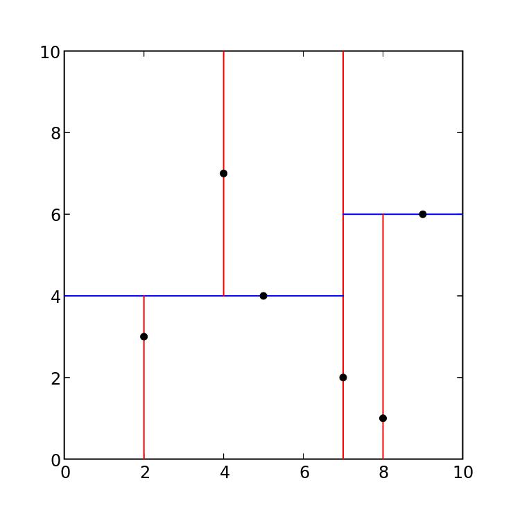

# DBSCAN-distributed
Implementazione Scala + Spark dell'Algoritmo di clustering DBSCAN

## Algoritmo  DBSCAN 

L'algoritmo *DBSCAN(Density-Based Spatial Clustering of Applications with Noise)* e' un algoritmo di clustering. Come si intuisce dal nome, l'idea principale alla base di questo metodo e' quella di raggruppare insiemi di punti in base alla densita' in una determinata area e di contro escludere quei punti troppo isolati, etichettandoli come rumore.
L'algoritmo, a differenza di altri metodi di clustering come ad esempio *K-means* non prevede di specificare in anticipo il numero di cluster ma si prepone di trovarlo solo alla fine dell'esecuzione.

Per fare cio' questo algoritmo itera i vettori nel dataset, per ogni vettore *p* determina tutti i punti nel suo neighborhood(vicinato),calcolando tutti quei punti che si trovano ad una distanza *d* minore di un certo valore **Epsilon**.

Una volta calcolati tutti i punti vicini li conta, se questo conteggio *c* risulta essere minore di un certo valore prestabilito *minCount* allora *p* e' etichettato con label *NOISE* altrimenti questo, insieme a tutti i sui vicini, diventa il primo nucleo di un nuovo cluster. 

Per ogni punto nel vicinato, l'algoritmo va ad individuare ricorsivamente la densita' nel suo intorno e ad aggiungere al cluster tutti i nuovi punti in quell'area fintanto che la densità non scende sotto una certa soglia **(minCount/&pi; epsilon^2)**.

L'algoritmo termina nel momento in cui tutti i punti nel *DataSet* sono stati etichettati. 
    

 
<a href="https://towardsdatascience.com/the-5-clustering-algorithms-data-scientists-need-to-know-a36d136ef68"> Image From Here </a>

## Implementazione

### Introduzione
Per prima cosa importiamo il dataset, che supponiamo essere nel file **clusterin**, in un RDD Spark 

~~~scala
val linesList = sc.textFile("clusterin")
~~~
La funzione **SparkContext.textFile** restituisce una struttura dati dove ogni elemento e' una riga del file in input. Convertiamo questa struttura in una lista contenente delle coppie di *Double* che rappresentano le coordinate dei punti nel piano cartesiano 

~~~scala
val regex = "\\s+"
def toFloat(s: String): Float = {
  try {
    s.toFloat
  } catch {
    case e: Exception => 0
  }
}
def toCouple(a : Array[Float]) : Array[(Float,Float)]= {
val c =(a(0),a(1))
Array(c)
}
val points=linesList.flatMap(x=>toCouple(x.split(regex).map(x=>toFloat(x))))
~~~

### Architettura
Sappiamo come un cluster Spark sia composto da un nodo detto *Driver* che ha il compito di fare da facciata tra l'applicazione ed i nodi *Executor*. In questo scenario e' importante capire quali sono le strutture dati in gioco ed in quali nodi queste si trovino.

Importando il dataset tramite la chiamata alla funzione *textFile*, abbiamo creato uno struttura dati contenente una rappresentazione dei punti nel dataset. Questi punti vengono partizionati e memorizzati sui nodi *Executor* e la struttura e' associata alla variabile **points**.

Creiamo poi una copia **non** distribuita della struttura points, da mantenere sul nodo *Driver*, chiamiamo questa struttura **driverP**

~~~scala
val driverP = points.collect()
~~~

In seguito creiamo una mappa per etichettare ogni punto nel dataset. Inizializziamo tutte le etichette al valore **UNDEF**. Chiamiamo questa struttura **labels** e questa sara' anch'essa memorizzata nel nodo *Driver*

~~~scala
//https://stackoverflow.com/questions/7938585/what-does-param-mean-in-scala
// : _* PASS EACH ELEMENT IN SEQ AS SINGLE ARGUMENT TO MAP CONSTRUCTOR
val labels = collection.mutable.Map(   points.collect().map( (_,UNDEF) )   toSeq : _*)
~~~
Un'altra struttura dati, utile per facilitare la ricerca dei punti *Neighbor*, che e' stata implementata e' un albero di ricerca bidimensionale.
~~~scala
val searchTree = new InNode(d,driverP,0)
val treeBC = sc.broadcast(searchTree)
~~~
Tale struttura viene memorizzata in ogni nodo *Executor*, per poi potere invocare il metodo **rangeQuery** che iterando l'albero restituisce i punti nell'intorno *epsilon* del punto.

 

Questo albero di ricerca in inglese prende il nome di *KdTree* dove **K** rappresenta la dimensione dei vettori che vengono ordinati all'interno della struttura, mentre **d** e' la profondità prefissata dell'albero.
Ad ogni livello i vettori vengono ordinati secondo la componente **l%k**,
dove **l** rappresenta il livello corrente dell'albero, compreso nell'intevallo **[0,d]**. Una volta ordinata la lista dei vettori, viene estratto il valore mediano che verra' memorizzato nella radice dell'albero e viene chiamato valore *pivot*. La parte di lista precedente il valore mediano viene memorizzata nel sotto-albero di sinistra, mentre la parte succesiva viene memorizzata nel sotto-albero di destra. Viene ripetuta ricorsivamente questa operazione di suddivisione dei punti sui due sotto-alberi figli, fino a che non si raggiunge la profondita' **d**.

Ottenuto l'albero ordinato, nel momento in cui si vuole cercare l'insieme dei punti nell'intorno di raggio **Epsilon** di un certo vettore **p**, viene invocato come detto precedentemente, il metodo **rangeQuery**.

Come mostra la figura l'albero suddivide lo spazio in aree di forma rettangolare, mentre il nostro algoritmo prevede la ricerca di punti in aree circolari. Pertanto durante la ricerca dei punti sull'albero, andiamo a selezionare la minima area rettangolare che comprende il nostro intorno circolare.
Tra tutti i punti che sono presenti nel primo insieme vengono poi filtrati quelli effetivamente utili all'algoritmo tramite una scansione lineare che ne calcola la distanza rispetto al centro dell'intorno **p**.  La complessità di tale operazione  dipende sia dalla profondita' dell'albero che dalla conseguente dimensione dei nodi foglia che devono essere scansionati linearmente.
<kbd>

</kbd>
|
<kbd>

</kbd>

### Main loop
Prima di avviare la computazione, dobbiamo definire due valori, che sono **Epsilon** e **MinCount**. Questi parametri definiscono il comportamento dell'algoritmo e nella nostra implementazione vengono passati da linea di comando tramite gli argomenti `--eps` e `--minc` rispettivamente.

Inoltre dobbiamo definire la funzione di distanza tra due punti dello spazio. Nel caso particolare, la nostra libreria prevede di lavorare su punti nello spazio bidimensionale. Tuttavia e' possibile ovviare a questa limitazione, sia applicanto ai vettori in input degli algoritmi di riduzione della dimensionalita' come ad esempio l'algoritmo **PCA**, sia definendo una specifica funzione *distance* che di fianco al dataset definisca la distanza tra due punti nello spazio individuato dai dati. Essendo infatti `Scala` un linguaggio funzionale, non e' difficile pensare ad una versione *higher-order* della nostra funzione contenente il main-loop, che riceva in input la funzione *distance* definita dall'utente utilizzatore.

Nel nostro caso comunque la libreria prevede di ricevere punti bidimensionali e per tanto la funzione *distance* sara' semplicemente la distanza euclidea tra due punti 

~~~scala

def distance(p1:(Double,Double),p2:(Double,Double))= 
    math.sqrt(math.pow(p1._1-p2._1,2)+math.pow(p1._2-p2._2,2))
~~~

Con queste premesse possiamo analizzare il cuore dell'algoritmo implementato.

Per etichettare ogni punto p come appartenente ad un determinato cluster, dobbiamo per prima cosa calcolare l'insieme dei vettori che si trovano all'interno del Neighborhood di p. Questo e' definito come l'insieme dei punti che hanno distanza da p minore del parametro Epsilon.
~~~scala
 var queue = searchTree.rangeQuery(epsilon,p,distance,0).toSet
~~~
Sia **N** questo insieme iniziale, che viene creato nel *Driver*. I punti appartenti ad **N** sono quindi trasmessi ai nodi *Executor*. Tramite il metodo *SparkContext.parallelize* l'insieme viene partizionato sui vari *Executor*, chiamiamo questa partizione **sN**. Ogni nodo si occupera' di calcolare, per ogni punto in **sN**, il relativo *neighborhood*. L'unione di tutti i vicinati,  viene raccolta nuovamente nel *driver* (tramite funzione *RDD.Aggregate*) e memorizzata nel insieme che chiamiamo **nN**. Qui **nN** prende il ruolo che prima aveva l'insieme **N** e vengono ripetute le stesse operazioni fin tanto che **nN** non risultera' vuoto.
Tutti i punti negli insiemi **N ed nN** andranno a creare un nuovo cluster, a condizione che siano presenti un numero di punti maggiore di **minCount**.
Come sara' evidente nei risultati che presentermo nelle sezioni successive, tanto piu' è grande l'insieme **nN** tanto maggiore sara' la scalabilita' del'algoritmo. La dimensione di questo insieme però non dipende dalla grandezza del *Dataset* in input bensi' dalla configurazione di parametri che definiscono matematicamente l'intorno di ogni punto 
(**epsilon e minCount**)
### Criticita' e soluzioni alternative

La fase dell'algoritmo che computazionalmente e' piu' costosa, e' sicuramente la ricerca dei vicini per un determinato punto **p**. Per fare questa ricerca infatti, la modalita' piu' ovvia e' quella di confrontare **p** con ogni altro punto nel *Dataset*. Questa operazione ovviamente non e' molto efficiente, considerando il fatto che per un applicazione distribuita ci si aspetta di lavorare con *Dataset* di grandi dimensioni. La complessita' di questo approccio e' infatti nell'ordine di *O(n)* dove *n* e' la dimensione del *Dataset* in input.

Abbiamo preso in considerazione alcune alternative, per cercare di ottimizzare la complessita' dell'operazione di ricerca dei vicini. Le alternative vagliate sono state le seguenti : 

- In una prima implementazione avevamo pensato di suddividere la scansione sequenziale di tutti i punti sui nodi *Executor* in modo che ognuno di questi effetuasse **N/e** confronti, dove **N** e' il numero totale di confronti da fare per trovare il vicinato di un punto **p**, ed **e** e' il numero di *Executor* a disposizione all'interno del cluster. Questa implentazione nonostante sia scalabile quando si vuole calcolare il vicinato di <ins>pochi punti</ins>, non lo e' invece nel momento in cui si deve calcolare il vicinato di tutti i punti nel *Dataset*. Nonostante la suddivisione sugli *Executor*, il numero di cofronti continua ad essere nell'ordine di **O(n^2)** per ognuno dei nodi. A dimostrazione di quanto detto riportiamo un caso di esecuzione particolarmente inefficiente.
Durante la fase di testing di questa prima implementazione infatti, l'esecuzione dell'algoritmo su un *Dataset* di 400mila vettori, con configurazione di parametri **epsilon=200,minCount=200** ed un numero di nodi di calcolo pari a 2, il tempo di esecuzione risultava essere di: **239857,80 secondi(66,62 ore)**

- **Pre-calcolare una matrice delle distanze**: durante la fase di progettazione dell'algoritmo, abbiamo analizzato l'implementazione di *DBSCAN* nella libreria **Scikit-learn**. Nonostante tale implementazione sia una versione sequenziale, ci e' sembrato interessante l'utilizzo di una matrice, dove vengono pre-calcolate le distanze tra i punti.   Tuttavia, anche se questo espediente potrebbe apportare dei miglioramenti in termini di complessita' temporale, e' noto agli utilizzatori della libreria che questa implementazione e' considerevolmente inefficiente in termini di complessita' spaziale. Questo rende tale approccio inutile ai nostri fini, che sono quelli di lavorare con grandi *Dataset*. 

## Test

### Dataset 

Il dataset utilizzato per i test di performance e' disponibile  
sul repository  dell'<a href="https://archive.ics.uci.edu/ml/machine-learning-databases/00550/"> Universita' della California</a>.  
Scaricato il file zip ed estratto, siamo interessati al file 
**urbanGB.txt**. Per rendere questo file utilizzabile dalla nostra applicazione
viene riformattato attraverso il comando 

~~~sh
cat "urbanGB.txt" | sed -Ee 's/([+-]?[0-9]+\.?[0-9]*e?[+-]?[0-9]*)\s*,\s*([+-]?[0-9]+\.?[0-9]*e?[+-]?[0-9]*)/\1 \2/g' 1>"clusterin"
~~~

Nel dataset sono contenute coordinate sotto forma di latitudine e longitudine per **360177** punti di incidenti urbani avvenuti in Regno Unito. 

### Correttezza
Il primo test effetuato è stato sulla corettezza della struttura dati **KdTree**. In particolare abbiamo confrontato l'insieme dei vicini che il metodo **rangeQuery** restituisce per un dato punto **p**, con l'insieme ottenuto da un semplice confronto sequenziale tra tutti i punti. 
~~~scala
val eps = 0.1
var BETTER_TREE = 0
var BETTER_NORMAL = 0
for(el <- testArr){
    var t0 = System.nanoTime
    val fromTree = testTree.rangeQuery(eps,el,distance,0)
    var t1 = System.nanoTime
    //println("SEARCH TREE : "+(t1-t0)/math.pow(10,9)+" seconds")
    var treeTime = (t1-t0)
    t0 = System.nanoTime
    val normal = testArr.filter(distance(el,_)<=eps)
    t1 = System.nanoTime
    //println("SEARCH NORMAL : "+(t1-t0)/math.pow(10,9)+" seconds")
    var normTime = (t1-t0)
    if(treeTime>normTime){BETTER_TREE+=1}
    else{BETTER_NORMAL+=1}
    //println("")
    
    if(fromTree.length != normal.length){ println("NOT THE SAME SIZE")}
    else{
        for(c1 <- normal){
            var found = false
            for(c2 <- fromTree){
                if(c1._1 == c2._1 && c1._2 == c2._2){found = true}
            }
            if(!found){
                throw new RuntimeException("Neighbor not found by search tree")
            }
        }
        for(c1 <- fromTree){
            var found = false
            for(c2 <- normal){
                if(c1._1 == c2._1 && c1._2 == c2._2){found = true}
            }
            if(!found){
                throw new RuntimeException("Neighbor not found by normal search")
            }
        }
    }
}
println("BETTER TREE : "+BETTER_TREE+" times")
println("BETTER NORMAL : "+BETTER_NORMAL+" times")
~~~

    BETTER TREE : 11160 times
    BETTER NORMAL : 4 times

In seguito grazie alla libreria python [Scikit-Learn](https://scikit-learn.org/stable/), che contiene un implementazione sequenziale dell'algoritmo DBSCAN, siamo stati in grado di verificare la correttezza dell'algoritmo implementato.  

  Abbiamo avviato due esecuzioni sull'algoritmo **Scikit-Learn** con due differenti configurazioni di parametri :

| EPSILON     | MIN COUNT   |
| ----------- | ----------- |
| `200`       | `200`       |
| `0.07`      | `20`        |

in modo tale da ottenere, nel primo caso un unico cluster che comprendesse tutti i punti, mentre nel secondo caso un numero sufficientemente elevato di cluster.

Questo test e' stato  effettuato in quanto avevamo modo di credere, da un analisi statica del codice, che le prestazioni potessere variare in funzione dei parametri ed in particolare il numero di cluster che questi avrebbero portato ad individuare. Questa intuizione si e' poi rivelata esatta, come vedremo.

Da questi test iniziali, i cluster individuati sono quelli illustrati in figura :

**Esecuzione 1 (E=200,M=200)**

**Esecuzione 2 (E=0.07,M=20)**

*Nota : L'esecuzione del primo esempio ha impiegato molto piu' tempo rispetto al secondo*

Il dataset contenente circa 300 mila istanze e' troppo grande perche' lo script per rappresentare graficamente i dati lo possa elaborare su una singola macchina, per questo motivo il dataset e' stato campionato e sono stati estratti un ottavo dei dati

Lo script python utilizzato per creare questi risultati e' disponibile [qui](../py-util/pydbscan.py)

### Efficienza 

Di seguito vengono riportati i dati riguardanti i test sulle tempistiche di esecuzione dell'algoritmo implementato. Per effettuare questi test, abbiamo utilizzato il servizio EMR di AWS (*Amazon Web Services*). Su tale servizio abbiamo creato cluster da 2/4/8/16 Nodi *Executor* di tipologia **m4.large**. Questo tipo di istanze dispone di 2 *vCPU* corrispondenti a 2 *HW-thread* di Processori **Intel Xeon E5-2686 v4** da 2.3 GHz. Su questi cluster e' stata lanciata una suite di 48 Test che differiscono per numero di vettori in input, parametri dell'algoritmo e tipologia di cluster. Degli ultimi due aspetti abbiamo gia' parlato in precedenza, mentre per quanto riguarda il numero di vettori in input, abbiamo gia' detto che il *dataset* contiene circa 300 mila vettori. Per testare le prestazioni dell'algoritmo su *dataset* di dimensioni variabili, abbiamo campionato dal *dataset* completo 1/32, 1/16, 1/8, 1/4 ed 1/2 dei vettori per poi andare ad eliminare le coppie di punti ripetute. 
Abbiamo misurato i tempi di esecuzione di ogni singola configurazione e vengono riportati di seguito in secondi. 

Il risultati per la configurazione di parametri **[Epsilon=0.07,minCount=20]** sono riportati in tabella ed in seguito graficamente :  

#### CONFIGURATION : Epsilon = 0,07 MinCount = 20    

| # DATASET                                                     | 11164 | 22166 | 43679 | 85002 | 162862  | 304675   |
|---------------------------------------------------------------|--------|--------|--------|--------|----------|-----------|
| 2-Nodes m4.large  [2-vCPU from Intel Xeon E5-2686 v4@2,3 GHz] | 81.70  | 102.83 | 163.52 | 239.93 | 507.57   | 1291.24  |
| 4-Nodes                                                       | 84.27  | 109.16 | 156.46 | 229.03 | 445.51   | 1010.65  |
| 8-Nodes                                                       | 95.57  | 130.43 | 179.73 | 241.59 | 406.05   | 824.48    |
| 16-Nodes                                                      | 120.49 | 138.88 | 191.98 | 268.12 | 489.39   | 867.20    |

Graficamente :
<kbd>
.png)
</kbd>

I risultati per la configurazione di parametri **[Epsilon=200,minCount=200]** sono riportati in tabella ed in seguito graficamente : 
#### CONFIGURATION : Epsilon = 200 MinCount = 200  

| # DATASET                                                     | 11164 | 22166 | 43679 | 85002 | 162862  | 304675   |
|---------------------------------------------------------------|--------|--------|--------|--------|----------|-----------|
| 2-Nodes m4.large  [2-vCPU from Intel Xeon E5-2686 v4@2,3 GHz] | 48.83  | 81.26  | 227.29 | 870.99 | 3502.70 | 18136.12 |
| 4-Nodes                                                       | 43.10  | 59.52  | 135.51 | 465.81 | 2465.11 | 9612.66  |
| 8-Nodes                                                       | 45.95  | 50.63  | 95.64  | 266.63 | 1008.32 | 5054     |
| 16-Nodes                                                      | 48.05  | 56.21  | 81.81  | 175.96 | 635.18   | 2439.27  |

Graficamente:
<kbd>
.png)
</kbd>

Come sottolineato nelle sezioni precedenti, vediamo come la scalabilita' dell'algoritmo sia significativa laddove l'insieme di punti che ogni Nodo deve elaborare e' di una cardinalita' grande a sufficienza. Questo e' possibile solo in configurazioni che vanno a generare un numero di cluster ridotto (Esempio **[Epsilon=200,minCount=200]**) oppure dove il numero di Nodi *Executor* non e' cosi' elevato da dividere il dataset in sottoinsiemi troppo piccoli. Ovviamente, mentre la prima condizione non e' prevedibile a priori, sulla seconda l'utilizzatore del software implementato ha un controllo maggiore.  

## Compilazione ed Esecuzione

Per compilare ed eseguire il codice, seguire le istruzioni nel documento [README.md](../README.md)